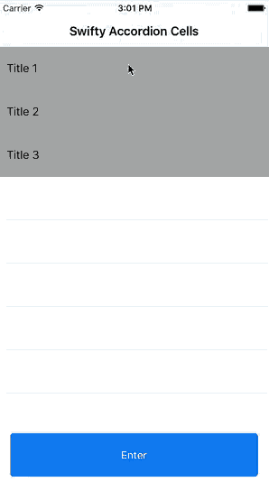

# Swifty Accordion Cells

Example Swift 3.0 Xcode 8.0 project which demonstrates how to expand and collapse a UITableView like an accordion. Using this lightweight data structure approach, UITableViewCell header/sub-item rows can be added or removed dynamically as needed. Subclass table for further reuse.
